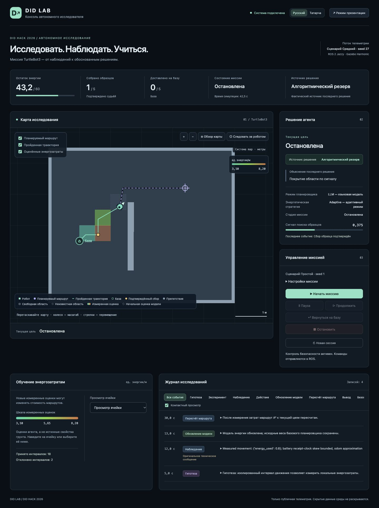

# DID LAB: результат frontend-редизайна

Ветка `feature/mission-dashboard` создана в отдельном существующем worktree
от обновлённой `origin/dev` (`2166049`). Рабочая копия перед началом была чистой.
Основной checkout `/Users/kirito/Desktop/DID_hack` остался на `dev`.
Изменения ограничены `apps/frontend/`; backend, ML, ROS и Docker не изменялись.
API-команды, пути и внутренние идентификаторы сохранены. Merge не выполнялся.

## Экран и функции

- Тёмная нейтральная палитра, зелёный робот/траектория, сиреневый маршрут/цель,
  янтарный подтверждённый сбор. Раздельные статусы связи и миссии.
- Шапка: DID LAB, соединение, Русский / Татарча, режим презентации.
- Показатели: энергия, собранные/доставленные образцы, состояние и опубликованный
  источник последнего решения. Без телеметрии — прочерки, а не придуманные нули.
- Карта — основной блок. Рядом решение агента и компактные команды;
  сложные параметры раскрываются в настройках. Сценарий/seed видны и при закрытых
  настройках. Параметры активной миссии блокируются.
- Start, Pause, Resume, Return, Stop, Reset сохранены. Stop не требует подтверждения
  и не зависит от корректности seed. Reset требует локализованного модального
  подтверждения; отмена и Escape предусмотрены. Одновременные команды блокируются.
- Нижняя строка: энергетическая модель с инспектором и журнал с фильтрами,
  категориями, временем симуляции, компактным/расширенным описанием.
- Presentation: крупная карта/робот/траектория и показатели, последние пять
  записей, минимум настройки/инспектора. Команды безопасности остаются доступны.
  Выход кнопкой или Escape. Никакой тестовой телеметрии в production-коде нет.
- Адаптивные desktop/tablet/mobile раскладки, видимый фокус, локализованные
  доступные названия, клавиатурное управление картой, reduced motion.

## Локализация

[Система переводов и глоссарий](LOCALIZATION.md). Типизированные стабильные
ключи, проверка отсутствующих ключей и параметров, `Intl.NumberFormat`, безопасное
восстановление localStorage. Известные сообщения агента локализованы точными
соответствиями; произвольные технические строки сохраняются без искажения.
Все словари переведены, но татарский **не проверен носителем**. Термины для
проверки перечислены в глоссарии; эта оговорка относится ко всему татарскому тексту.

## Карта и энергетика

Растр OccupancyGrid кешируется отдельно; нижняя ROS-строка переворачивается ровно
один раз. Origin и origin_yaw применяются к карте; мировая Y направлена вверх.
База соответствует публичной текущей конфигурации (-2; -0,5) м. Робот рисуется
как круглый корпус с колёсами/лидаром и стрелкой фактического yaw. Положение
берётся из robot_pose без выдуманного движения между полученными снимками.

Раздельные линии маршрута и наблюдаемой траектории, цель и подтверждённые места
сбора. Последние — позиции робота при подтверждении, не координаты скрытых образцов.
Масштаб к курсору колесом, кнопки +/-; drag, стрелки, Home; обзор карты и режим
следования. При ручном перемещении следование выключается. При автоматическом
обзоре камера подстраивается под изменение размеров. Canvas учитывает DPR,
ResizeObserver и уменьшает число точек длинной траектории только на субпиксельных
участках, сохраняя начало/конец и видимые детали.

Энергетические ячейки 0,5 м повёрнуты на origin_yaw. Цветовая шкала — минимальная
и максимальная **измеренная оценка текущего снимка**, единицы — энергия/м;
цвета между снимками не означают неизменную абсолютную стоимость.
Измеренные ячейки залиты цветом; начальные оценки бледные с пунктирной рамкой.
Они исключены из диапазона измерений. При одинаковых оценках шкала одноцветная.
Число измерений, значение uncertainty (или явное отсутствие), энергия поворотов
и turn_uncertainty доступны в tooltip / клавиатурном select-инспекторе.
Никаких процентов уверенности не вычисляется.

Baseline: наблюдения собираются, веса маршрута сохраняются.
Adaptive: измеренные оценки могут изменять стоимость маршрута.
Счётчики принятых/отклонённых интервалов показываются только из energy_diagnostics.

## Решения и безопасность

`planner_source`, а не выбранный режим, определяет отображаемый источник.
При `planner_mode=llm`, `planner_source=Algorithmic` отображается
«Алгоритмический резерв». Без данных источник неизвестен.
Цель, объяснение, стадия, энергия, сигнал и результаты берутся из публичного API.
Исходный код неизвестного статуса и оригинал неизвестной причины не скрываются.
Ошибки backend/HTTP, защитная остановка и уже зарегистрированные опасные события
выделяются; при потерянной связи данные помечаются как последние наблюдаемые.
Восстановление свежих WS-снимков восстанавливает состояние связи.

## Реально выполненные проверки

Дата: 9 октября 2026. Node 24.19.0; React 19.2.0; TypeScript 5.9.3; Vite 7.2.2.
Зависимости установлены в worktree; новые runtime-зависимости не добавлены.

| Проверка | Результат / границы |
|---|---|
| TypeScript `tsc -b` | Пройдено |
| Production `vite build` | Пройдено |
| Node tests | 16 тестов: словари/параметры, локаль, Unicode, координаты, поворот/fit, hit-test, 30 000 точек, линейка, растр, источник/диагностика, API/seed/errors |
| Compile-time тесты переводов | Неизвестный ключ, неверный/пропущенный/лишний параметр и неизвестная локаль отклоняются TypeScript |
| RU → TT → reload → RU в браузере | Пройдено до блокировки браузерного ввода; татарские строки и буквы видны |
| Backend отсутствует | Реальное offline-состояние показано; Start отключён, карта не имитирует движение |
| Start + scenario/seed/mode/planner | На test fixture передан `{scenario:medium, seed:27, mode:adaptive, planner_mode:llm}` |
| Pause / Resume / Return / Stop | Браузерные действия записаны test API как отдельные правильные команды; Pause/Stop подтверждены отображением состояния |
| LLM fallback | На fixture показан алгоритмический источник при выбранном LLM |
| Desktop 1440, tablet 768, mobile 390 | Просмотр раскладок; для 768/390 scrollWidth совпал с viewport, горизонтального переполнения страницы нет |
| JS errors в проверенной вкладке | В конце чтение console error вернуло пустой список |
| Скриншоты | Desktop/mobile RU сохранены ниже; **синтетическая fixture, не реальная миссия** |

Тестовый журнал запросов подтвердил пути `/api/missions`, `/api/command` и тела
`pause`, `resume`, `return`, `stop`. Unit-тест отдельно проверяет маршрут/параметры
Reset и успешный/ошибочный ответ. Все добавленные тесты локальны и легковесны.

## Непроверенное и блокер

После открытия первоначального системного `confirm()` для Reset браузер перестал
передавать клики/клавиши. Две попытки управления диалогом не помогли; новая вкладка
читалась и давала скриншоты, но также не реагировала на ввод. Системный confirm
заменён доступным HTML dialog с локализованными кнопками, но **интерактивный Reset
после этой замены не подтверждён браузером**. Не выдаём его unit-тест за UI-проверку.

По той же причине не завершены ручные проверки zoom/drag/follow/слоёв/tooltip,
фильтров/раскрытия журнала, Presentation/выхода, модального focus trap и Escape.
Геометрия карты и переводы проверены отдельно; это не полный интерактивный тест.
Не проверены реальные ROS/Gazebo-команды, odom/map в живой миссии, реальный LLM,
DPR 2 на аппаратной Retina, sustained FPS, Safari/Firefox и шрифты других ОС.
Gazebo/Docker не запускались. Screenshot fixture не доказывает робототехническую
работоспособность. После закрытия старого браузерного диалога пройти оставшиеся
пункты на test fixture, затем проверить интеграцию с реальным backend.

## Возможные дополнения API, без изменений backend

База и ёмкость батареи пока соответствуют публичным параметрам текущего проекта:
BASE=(-2; -0,5), capacity=60. Для произвольной новой конфигурации желательно публичное
поле base_pose / battery_capacity. Сервер не передаёт отдельный stage миссии,
decision_id, время конкретного решения или атомарную связь goal ↔ planner_source:
показываем опубликованные поля, не придумываем дополнительную точность.
Для качественной локализации будущих свободных сообщений полезны message_code и
структурированные параметры; текущий frontend не требует изменения контракта.

## Скриншоты и запуск

[Русский mobile — только синтетический тестовый API](screenshots/ru-mobile-fixture.jpg).

Команды запуска и проверки — [в README](../README.md).
